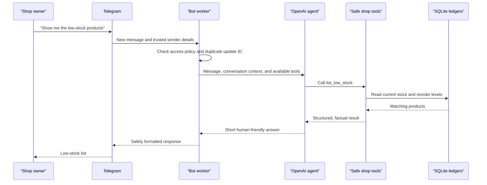

# How the Kirana Ops Agent Works

> A plain-English guide for non-technical readers · About a 5–10 minute read

## The short version

The Kirana Ops Agent is a controlled-access shop assistant inside Telegram. It starts with a fictional 120-product demo catalog, and a shop owner can write normal messages such as:

- “Show me the low-stock products.”
- “Twenty packets of Amul Butter came in.”
- “Create a cash bill, but do not finalize it yet.”
- “Send the latest invoice as a PDF.”

The application sends the message to an OpenAI model. The model understands what the owner is asking and chooses from a controlled set of shop tools. Those tools—not the AI model—read or change the real store data.

This distinction is important: **the AI understands the conversation, while normal Python code enforces the business rules.** The AI cannot directly edit stock, invent an invoice, or write into the database.

## The main parts

Think of the application as a small team:

| Part | Simple role |
|---|---|
| Telegram | The front desk where the owner sends messages and receives answers or files. |
| Telegram bot worker | The receptionist that accepts messages, checks the sender, and delivers responses. |
| OpenAI agent | The manager that understands plain language and decides which shop tools are needed. |
| Shop tools | Trained staff members for catalog search, stock, billing, GST, Khata, reports, and files. |
| Business service | The rule book that checks stock, prices, payment details, confirmations, and transaction safety. |
| SQLite databases | The locked ledgers that remember store records and conversation context. |
| PDF and PowerPoint generators | The back-office printers that create invoices and sales decks from saved records. |

There is no separate website, command menu, or admin dashboard. Telegram is the user interface.

## The journey of one message

Here is the same flow one step at a time.

### 1. Telegram receives the message

Telegram gives the running bot a new update containing the message, chat, sender, and a unique update number. During local development, the bot keeps asking Telegram for new updates. This is called polling.

### 2. The bot checks who sent it

The default policy requires the sender's numeric Telegram user ID in `AUTHORIZED_TELEGRAM_USER_IDS`; anyone else is rejected. For a supervised demo, `ALLOW_ALL_TELEGRAM_USERS=true` temporarily accepts any identified Telegram sender. This is full access, not read-only access, and changing either mode requires a bot restart.

The policy checks the sender, not whether the chat itself is private. Avoid public mode in groups because different users can see store data and interfere with the shared group draft or conversation.

The trusted user ID, chat ID, and Telegram update ID come from Telegram itself. The AI cannot choose or change them.

### 3. The bot protects against duplicate work

Before processing an operational message, the application records its unique Telegram update ID. This prevents the same delivery from selling an item twice, receiving stock twice, or recording the same Khata payment twice. An in-memory lock also keeps two messages from the same chat in order while the current single bot worker is running.

If Telegram retries a message that already completed, the application can reuse the saved result instead of repeating the business action.

### 4. The application prepares useful context

The agent receives the owner's message together with the local date and time, saved preferences, any open bill draft for that chat, and recent conversation context.

This is why a conversation can continue naturally across messages. For example, after creating a draft, the owner can simply say “Cash” and then “Confirm.”

### 5. The OpenAI agent understands the request

The application uses an OpenAI model through the API and the OpenAI Agents SDK. It does not send the request through the consumer ChatGPT website.

The model receives operating instructions, the user message, conversation context, and descriptions of the available tools. It decides whether to:

- answer from a known tool result;
- search for a product/customer or read stock/Khata;
- create or edit a bill draft;
- ask one clarification or call another tool.

There is no hard-coded keyword router. “Stock came in,” “received inventory,” and similar natural phrases can lead to the same stock-receipt tool because the model understands their meaning. Only the helper commands `/start`, `/help`, and `/new` are handled directly without asking OpenAI to interpret them.

### 6. A selected tool runs locally

When the model chooses a tool, the Agents SDK returns that tool request to the Python application. The model does not execute SQL, open local files, or change the database itself.

The selected Python tool calls the store's business service. The service checks the request, reads or writes SQLite, and returns a structured result—for example, new stock, a GST bill preview, an ambiguous-product question, or a refusal caused by low stock or a missing UPI reference.

### 7. The agent may repeat the loop

The tool result goes back to the OpenAI model. The model may call another tool using the new factual information.

For example, one billing request may require several internal steps: find each product, open a draft, add all items, set the payment method, and preview the totals. The user still experiences this as one natural conversation.

Tool calls are run one at a time in this application, and each agent run has a fixed turn limit so it cannot loop forever.

### 8. The final answer returns to Telegram

Once the model has enough information, it writes a short shop-friendly response. The application saves the completed result, safely converts supported `**bold**` text for Telegram, and sends the response.

If a tool created a PDF invoice or PowerPoint sales deck, the bot sends that file after the text response.

## Example: buying one product and receiving a PDF

The live conversation for one Fogg Body Spray demonstrates the safety boundary:

1. The owner asks whether one bottle is available.
2. The agent searches the catalog and reads stock through tools.
3. The owner asks to buy it, so the agent adds it to an **open draft**; stock has not changed yet.
4. The agent asks for Cash, UPI, Card, or Khata. UPI and Card require a real reference.
5. After Cash is selected, a preview shows the item, total, and included GST.
6. The owner says “Confirm,” and only then does the finalization tool complete the sale.
7. A later PDF request reads the finalized bill and generates the invoice file.

During finalization, ordinary Python code rechecks stock, price, tax, cost, MRP, payment information, and the latest draft version together. It then creates the invoice record and reduces stock inside one database transaction. Either the complete operation succeeds, or it is rolled back.

A sentence from the model cannot bypass this process or change the real store records by itself.

## What the AI decides—and what it does not

| The AI may decide | The application code controls |
|---|---|
| What the owner's sentence means and which tools fit | Allowed users and grounded product/customer IDs |
| Whether to ask a clarification | Saved prices, stock, cost, MRP, HSN, and GST rules |
| How to continue the conversation | Exact money calculations and rounding |
| How to summarize a success or explain a refusal | Confirmations, transactions, and duplicate protection |
| How to phrase the reply | Invoice numbers, ledgers, and generated files |

This design uses the AI for language and coordination, where it is useful, but uses deterministic code for money and irreversible actions, where consistency matters most.

## Where the information lives

| Location | What it contains |
|---|---|
| `data/kirana.sqlite3` | Products, stock, stock movements, drafts, finalized bills, customers, Khata entries, preferences, processed Telegram updates, and artifact records. |
| `data/agent_sessions.sqlite3` | Conversation history used by the OpenAI Agents SDK for each chat session. |
| `output/` | Generated invoice PDFs and sales PowerPoint files. |
| `.env` | The private OpenAI key, Telegram token, access-mode toggle, and authorized Telegram user IDs. |
| GitHub repository | Application code, tests, documentation, and fictional demo catalog—not `.env`, runtime databases, or customer-generated files. |

`/new` starts a fresh conversation session, but it does not erase the store. Stock, bills, Khata balances, drafts, and saved preferences remain in the store database. Preferences are validated settings, such as a default payment method or preferred staple product, rather than unrestricted “AI memory.”

Restarting the application also keeps the data as long as the `data/` and `output/` folders are preserved. A future cloud deployment needs persistent storage for the same reason.

## What information leaves the computer

Three systems are involved in a normal conversation:

1. **Telegram** carries the user's messages and the bot's replies or files.
2. **OpenAI API** receives the user message, relevant conversation context, compact current state, and individual tool results needed to reason about the turn.
3. **The application computer** stores the full operational database and generated files.

The complete SQLite database is not automatically uploaded to OpenAI. The agent sees the prompt, its conversation session, and the specific information returned by tools during that run. Sensitive tracing content is disabled in the agent configuration.

Because messages and selected tool results travel through external APIs, real deployments should follow the organization's privacy and data-retention requirements.

## Built-in safety and reliability

- **Locked by default:** configured Telegram IDs are required unless a supervised operator explicitly enables temporary public mode.
- **Secrets outside code:** API credentials stay in `.env` or deployment secrets and are excluded from GitHub.
- **Grounded facts:** existing product prices, taxes, stock, and customer balances come from tools, not model guesses.
- **Draft before sale:** a normal bill remains editable until the owner clearly confirms finalization.
- **Fresh validation:** finalization rechecks changing data instead of trusting an old preview.
- **All-or-nothing writes:** important mutations use database transactions.
- **Duplicate protection:** repeated Telegram updates and operation references protect critical stock, draft, billing, and Khata mutations from running twice.
- **Exact calculations:** money is stored as integer paise rather than imprecise floating-point values.
- **Safe files:** invoice PDFs are created only from finalized bill snapshots.
- **Redacted logs:** configured OpenAI and Telegram credentials are removed from application logs.
- **Safe Telegram formatting:** dynamic text is escaped before bold formatting is applied.

## What happens when something fails

- If the sender is not authorized, the bot refuses the request.
- If public mode is enabled, any identified Telegram sender can make OpenAI calls and change the shared store until the setting is disabled and the bot restarts.
- If the product is unclear, the agent asks which product the owner means.
- If stock is insufficient or a business rule fails, the tool refuses the change and the agent explains the useful reason.
- If payment information is incomplete, the draft stays open while the bot asks for the missing detail.
- If OpenAI or Telegram has a temporary network problem, the bot does not tell the owner to assume an unconfirmed success.
- If a critical mutation is retried, stored update and idempotency records protect against double stock movement or double payment.
- If the computer or bot process is off, Telegram can accept the user's message, but the application cannot answer until the worker runs again.

## Local operation versus 24/7 deployment

Today, the application can run as a background Python process on one computer. It polls Telegram, calls OpenAI when needed, and stores data locally.

For 24/7 operation, the same worker can run on a cloud service. The cloud version should keep the database and generated files on persistent storage, place credentials in protected environment settings, and remain continuously active. Larger production use would normally replace local SQLite and files with PostgreSQL and durable object storage.

The current implementation is intentionally a single-worker demo. Its per-chat message lock lives in that one process, Telegram delivery happens directly without a separate delivery queue, and local database/artifact files are not encrypted by the application. A production operator should restrict access to the machine, back up and encrypt storage, and add shared coordination and delivery retries before running multiple workers.

## One-minute recap

1. The owner writes naturally in Telegram.
2. The bot verifies the sender and protects against duplicates.
3. The OpenAI agent understands the request and chooses safe shop tools.
4. Python business code validates the operation and reads or changes SQLite.
5. Tool results return to the agent, which may take more steps.
6. The final answer—and any PDF or PowerPoint—is sent back through Telegram.
7. Store facts remain in durable local records, while the AI is used as the conversational coordinator rather than the source of truth.

For implementation details, see [Architecture](ARCHITECTURE.md). For running the project, see [Deployment](DEPLOYMENT.md). For the demonstration flow, see [Recording Guide](RECORDING_GUIDE.md).
